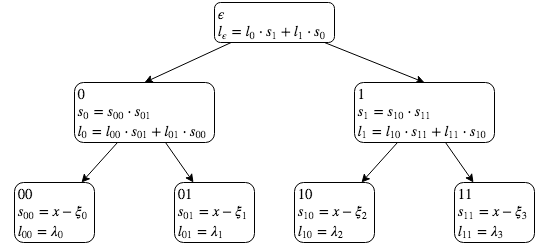

[@modern_computer_algebra, chapter 5.1-5.4 and 10.1-10.3]

## Problem 1
Let \(F\) be a finite field. In this case \(F=ℤ_p=\{0,1,...,p\}\) for \(p\) prime. Let \(φ_0∈F\) be a **secret** that we'll split into \(s\) **shares** such that **knowledge** of any \(k\) shares enables recovery of the secret.

1) Let \(ξ_1,ξ_2,...,ξ_s∈F\) be **distinct** and **nonzero**.
2) Select elements \(φ_1,φ_2,...,φ_{k-1}\) independently and uniformly at random.
3) Let \(f=φ_0+φ_1x+φ_2x^2+...+φ_{k-1}x^{k-1}∈F[x].\)
4) For \(j=1,2,...,s\) share \(j\) is the pair \((ξ_j, f(ξ_j))∈F^2.\)

The secret can be **recovered** by interpolating the \(k\) shares back into polynomial \(f\) and evaluation the polynomial at \(f(ξ_0)=f(0)=φ_0.\) We'll use Lagrange interpolation as the interpolating algorithm.

---

```python
from sympy import *
init_printing("mathjax")
import random
```

```python
a = 0
b = 99
p = nextprime(b)
a, b, p
```

$$\left ( 0, \quad 99, \quad 101\right )$$

```python
Z_p = list(range(p+1))
secret = random.randint(a, b)
shares = 10
knowledge = 5
secret,shares,knowledge
```

$$\left ( 42, \quad 10, \quad 5\right )$$

**Step 1**
```python
xi = random.sample(Z_p[1:], shares)
xi
```

$$\left [ 3, \quad 51, \quad 85, \quad 33, \quad 7, \quad 35, \quad 81, \quad 2, \quad 1, \quad 26\right ]$$

**Step 2**
```python
phi = random.sample(Z_p, knowledge-1)
phi
```

$$\left [ 17, \quad 42, \quad 50, \quad 9\right ]$$

**Step 3**
```python
x = symbols('x', integer=True, positive=True)
f = Poly(reversed([secret]+phi), x)
f
```

$$\operatorname{Poly}{\left( 9 x^{4} + 50 x^{3} + 42 x^{2} + 17 x + 42, x, domain=\mathbb{Z} \right)}$$

**Step 4**
```python
f_xi = [f(x)%p for x in xi]
f_xi
```

$$\left [ 25, \quad 11, \quad 30, \quad 55, \quad 73, \quad 2, \quad 42, \quad 81, \quad 59, \quad 53\right ]$$

```python
pairs = list(zip(xi, f_xi))
pairs
```

$$\left [ \left ( 3, \quad 25\right ), \quad \left ( 51, \quad 11\right ), \quad \left ( 85, \quad 30\right ), \quad \left ( 33, \quad 55\right ), \quad \left ( 7, \quad 73\right ), \quad \left ( 35, \quad 2\right ), \quad \left ( 81, \quad 42\right ), \quad \left ( 2, \quad 81\right ), \quad \left ( 1, \quad 59\right ), \quad \left ( 26, \quad 53\right )\right ]$$

**Recovering the secret**
```python
data = random.sample(pairs, knowledge)
data
```

$$\left [ \left ( 81, \quad 42\right ), \quad \left ( 3, \quad 25\right ), \quad \left ( 1, \quad 59\right ), \quad \left ( 7, \quad 73\right ), \quad \left ( 85, \quad 30\right )\right ]$$

```python
xi2, f_xi2 = list(zip(*data))
xi2, f_xi2
```

$$\left ( \left ( 81, \quad 3, \quad 1, \quad 7, \quad 85\right ), \quad \left ( 42, \quad 25, \quad 59, \quad 73, \quad 30\right )\right )$$

Source: https://stackoverflow.com/questions/4798654/modular-multiplicative-inverse-function-in-python/4798776

```python
def egcd(a, b):
    if a == 0:
        return (b, 0, 1)
    else:
        g, y, x = egcd(b % a, a)
        return (g, x - (b // a) * y, y)

def modinv(a, m):
    g, x, y = egcd(a, m)
    if g != 1:
        raise Exception('modular inverse does not exist')
    else:
        return x % m
```

```python
def lagrange_interpolation(u, v):
    assert len(u) == len(v)
    n = len(u)
    P = 0
    for i in range(n):
        s = v[i]
        for j in range(n):
            if i == j:
                continue
            s *= (x - u[j])*modinv((u[i]-u[j])%p, p)
        P += s
    return poly(expand(P, modulus=p))
```


```python
P = lagrange_interpolation(xi2, f_xi2)
P
```

$$\operatorname{Poly}{\left( 9 x^{4} + 50 x^{3} + 42 x^{2} + 17 x + 42, x, domain=\mathbb{Z} \right)}$$

Lets verify that our interpolation polynomial is correct.

```python
f==P
```

    True

Now we can recover the secret and verify that it is correct.

```python
P(0)
```

$$42$$

```python
P(0) == secret
```

    True


## Problem 2
Let \(R\) be a ring and let \(q,r∈R[x]\) with \(a = q b + r\) and \(\deg r < \deg b\) where \(b\) monic.

### (a)
Show that for all \(ξ∈R\) and \(f∈R[x]\) we have \(f(ξ)=f \operatorname{rem}\,(x-ξ).\)

---

Let \(a=f\) and \(b=(x-ξ)\) then
\[
\begin{aligned}
f(x) &= q(x)⋅(x-ξ) + r(x) \\
f(ξ) &= q(ξ)⋅(ξ-ξ) + r(ξ) \\
f(ξ) &= r(ξ) \\
f(ξ) &= f \operatorname{rem}\, (x-ξ). \\
\end{aligned}
\]

### (b)
Let \(a,b,c∈R[x]\), with \(b\) and \(c\) monic, and suppose that \(c\) divides \(b\). Show that \(a\operatorname{rem}c=(a\operatorname{rem}b)\operatorname{rem}c.\)

---

We have equalities \(a = q_1 b + r_1\) and
\(b = q_2 c + r_2\) where the remainders are \[r_1=a \operatorname{rem} b\] and \(r_2=0\) since \(c\) divides \(b\).

The remainder \(r_1\) can also be written in this form \(r_1 = q' c + r'\) where \(\deg r'<\deg c\). Then we have a remainder
\[
r'=r_1 \operatorname{rem} c = (a\operatorname{rem}b)\operatorname{rem}c.
\]

We also have
\[
\begin{aligned}
a &= q_1 b + r_1 \\
a &= q_1 (q_2 c) + (q' c + r') \\
a &= (q_1 q_2 + q') c + r'. \\
\end{aligned}
\]
Then the remainder \(r'\) has equivalency
\[
r'=a \operatorname{rem} c.
\]

By combining the equivalencies for the remainder \(r'\) we have
\[
a \operatorname{rem} c = (a \operatorname{rem} b) \operatorname{rem} c.
\]


## Problem 3
Let \(R\) be a ring, let \(ξ_0,ξ_1,...,ξ_{e-1}∈R\), and \(λ_0,λ_1,...,λ_{e-1}∈R\) be given as input. The form of the Lagrange interpolation polynomial suggests that one should first seek to construct the coefficients of the polynomial
\[
L_e(x)=∑_{i=0}^{e-1} λ_i ∏_{j=0\\j≠i}^{e-1}(x-ξ_j)∈R.
\]
Show that we can compute the coefficients of \(L\) in \(O(M(e)\log e)\) operations in \(R\). You may assume that \(e=2^k\) for a nonnegative integer \(k\). Here \(M(e)=e\log e \log\log e.\)

---

The common substructure within the polynomials is evident if we expand the Lagrange polynomials with \(e∈\{1,2,4\}\)
\[
\begin{aligned}
L_1(x)=& λ_0 \\
L_2(x)=& λ_0 (x-ξ_1) + λ_1 (x-ξ_0) \\
L_4(x)=& λ_0 (x-ξ_1) (x-ξ_2) (x-ξ_3) + \\
       & λ_1 (x-ξ_0) (x-ξ_2) (x-ξ_3) + \\
       & λ_2 (x-ξ_0) (x-ξ_1) (x-ξ_3) + \\
       & λ_3 (x-ξ_0) (x-ξ_1) (x-ξ_2) \\
      =& (λ_0 (x-ξ_1) + λ_1 (x-ξ_0)) ⋅ (x-ξ_2) (x-ξ_3) + \\
       & (λ_2 (x-ξ_3) + λ_3 (x-ξ_2)) ⋅ (x-ξ_0) (x-ξ_1).
\end{aligned}
\]

As can be seen, \(L_1\) is the base case (leaf nodes) and \(L_2\) (non-leaf nodes) form the rule for the recursive case. Then \(L_4\) can be computed using these rules as seen on the binary tree representation.



---

The **generalized form**: Let the depths of the nodes in the binary tree starting from root be \(i=0,1,..,k\) where \(k = \log e.\) We'll denote the nodes with binary string \(\{0,1\}^i=\{\{ε\},\{0,1\},\{00,01,10,11\},...\}\) for depths \(i=0,1,2,...\). There are binary \(2^{i}\) strings per at depth \(i\), i.e. number of nodes at depth \(i\).

TODO: the maximum size of polynomial at depth \(i\)

Each **leaf node** \(v∈\{0,1\}^k\)
\[
\begin{aligned}
s_v =& x-ξ_v \\
l_v =& λ_v
\end{aligned}
\]

In each **non-leaf** node \(u=\{0,1\}^{k'}\) where \(0≤k' < k\) the algorithm does the following computations
\[
\begin{aligned}
s_u =& s_{u0} ⋅ s_{u1} \\
l_u =& l_{u0} ⋅ s_{u1} + l_{u1} ⋅ s_{u0}.
\end{aligned}
\]
The algorithm will terminate once the **root** node \(ε\) is reached. Then \(l_ε=L(x)\). There is no need to calculate \(s_ε\). Since \(n=\deg s_u>\deg l_u\) for all \(u\in\{0,1\}^k\) the total computational complexity in each node is \(O(n \log n)\) using **fast polynomial multiplication**.

Total computational complexity from the multiplication operations can be calculated multiplying the number of nodes \(m_i\) with the complexity of multiplying polynomials with maximum degree of \(n_i\) at depth \(i\) and summing over the total depth of the binary tree \(i=0,1,...,k\). At depth \(i\) the binary tree has \(m_i=2^i\) nodes and polynomials have maximum degree of \(n_i=2^{\log e - i}\).
\[
\begin{aligned}
& ∑_{i=0}^{\log e} m_i ⋅ O(n_i \log n_i) \\
=& ∑_{i=0}^{\log e} 2^{i} ⋅ O(2^{\log e - i} \log 2^{\log e - i}) \\
=& O\left(∑_{i=0}^{\log e} 2^{i} ⋅ 2^{\log e - i} \log 2^{\log e - i}\right) \\
=& O\left(∑_{i=0}^{\log e} e (\log e-i)\right) \\
=& O\left(e∑_{i=0}^{\log e} i\right) \\
=& O\left(e ⋅ \frac{\log e(\log e + 1)}{2}\right) \\
=& O(e (\log e)^2).
\end{aligned}
\]


## Problem 4
Let \(R\) be a ring and let \(ξ_0,ξ_1,...,ξ_{e-1}∈R\) and \(η_0,η_1,...,η_{e-1}∈R\) such that \(ξ_i-ξ_j\) is a unit in \(R\) for all \(0≤i < j≤e-1\). Shot that we can compute the coefficients of the Lagrange interpolation polynomial
\[
L(x)=∑_{i=0}^{e-1}\left(η_i ∏_{j=0\\j≠i}^{e-1}(ξ_i-ξ_j)^{-1}\right) ∏_{j=0\\j≠i}^{e-1}(x-ξ_j)∈R[x]
\]
that satifies \(L(ξ_i)=η_i\) for all \(i=0,1,...,e-1\) in \(O(M(e)\log e)\) operations in \(R\). You may assume that \(e=2^k\) for a nonnegative integer \(k\).

---

Let \(f(x)\) be a polynomial
\[
f(x)=∑_{i=0}^{e-1} λ_i ∏_{j=0\\j≠i}^{e-1}(x-ξ_j),
\]
where \(λ_i=1\) for all \(i=0,1,...,e-1\). Then it's coefficients can be calculated using the algorithm from problem 3 in \(O(M(e)\log e)\) operations.

---

By batch evaluation the polynomial \(f\) in points \(ξ_k\) where \(k=0,1,...,e-1\) we have
\[
\begin{aligned}
f(ξ_k)&=∑_{i=0}^{e-1} ∏_{j=0, j≠i}^{e-1}(ξ_k-ξ_j) \\
&=∏_{j=0, j≠k}^{e-1}(ξ_k-ξ_j). \\
\end{aligned}
\]
Batch evaluation can be done in \(O(M(e)\log e)\) operations. The inverses of these values are the terms inside the Lagranges interpolation polynomial
\[
\begin{aligned}
f(ξ_k)^{-1}&=\left(∏_{j=0, j≠k}^{e-1}(ξ_k-ξ_j)\right)^{-1} \\
&=∏_{j=0, j≠k}^{e-1}(ξ_k-ξ_j)^{-1}.
\end{aligned}
\]

---

Using the results above, the Lagranges interpolation polynomial takes form
\[
L(x)=∑_{i=0}^{e-1} λ_i ∏_{j=0, j≠i}^{e-1}(x-ξ_j)
\]
where \(λ_i=η_i f(ξ_i)^{-1}\) for all \(i=0,1,...,e-1\). Then it's coefficients can be calculated using the algorithm from problem 3 in \(O(M(e)\log e)\) operations.

Therefore the total amount of operations is \(O(M(e)\log e).\)

## References
